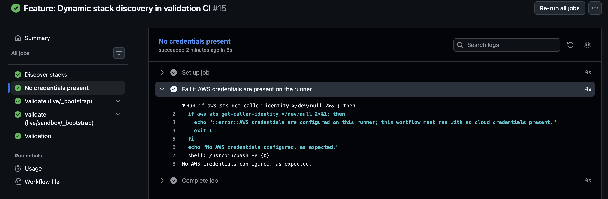

# Verification: the validation workflow has no cloud credentials

## Claim

`validation.yaml` runs on every pull request, including from forks (after approval), and has no access to any AWS or GCP account. It reads Terraform source only.

## Why it holds

When a pull request runs a workflow, GitHub executes the pull request's own copy of that file. So the guarantee cannot rest on what the file says — it rests on two structural facts:

1. The workflow references no secrets.
2. No job requests `id-token: write`. That permission is the only way a workflow here obtains cloud credentials. Permissions are `{}` at workflow level and granted explicitly per job.

## Verification

The `no-credentials` job asserts this on every run: it executes `aws sts get-caller-identity` and **fails if the command succeeds**.

First confirmed manually on 17-09-2026:

## Scope

Covers AWS credentials via the standard credential chain only. Says
nothing about other secrets.